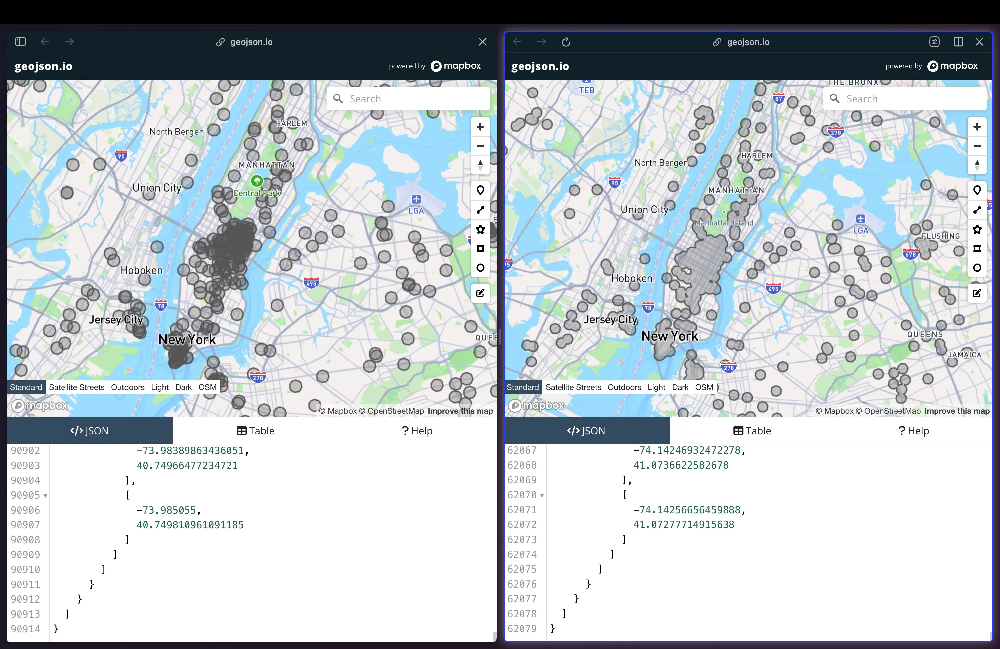

# PolyUnion

A fast and efficient js utility function designed for merging multiple polygons within a GeoJSON FeatureCollection. It utilizes spatial indexing provided by rbush and the geospatial processing of Turf to achieve high performance.

## Performance

When attempting to merge approximately 1000 circle-shaped polygons using only @turf/union, it took approximately 25 seconds. In contrast, PolyUnion completed the same task in about 350 milliseconds.



## Installation

You can install PolyUnion via npm:

```shell
npm install polyunion
```

## Usage

```js
import polyunion from 'polyunion';

// Example GeoJSON FeatureCollection input
const features = {
  "type": "FeatureCollection",
  "features": [
    {
      "type": "Feature",
      "properties": {},
      "geometry": {
        "type": "Polygon",
        "coordinates": [[[0, 0], [0, 1], [1, 1], [1, 0], [0, 0]]]
      }
    },
    {
      "type": "Feature",
      "properties": {},
      "geometry": {
        "type": "Polygon",
        "coordinates": [[[1, 1], [1, 2], [2, 2], [2, 1], [1, 1]]]
      }
    }
  ]
};

// Merge polygons
const mergedFeatureCollection = polyunion(features);

console.log(mergedFeatureCollection);
```

The function has 3 parameters:

- `featureCollection` (required): A GeoJSON FeatureCollection containing polygons to merge.
- `currentPass` (optional, default: 1): The current pass number. This is used internally for recursive calls and should not be set manually.
- `totalPasses` (optional, default: 3): The total number of passes for internal use in recursive calls. This parameter should not be set manually. The larger the number of iterations, the better the results, but the function will run slower. It depends on the number of polygons being merged. For the case above, 3 passes worked grat.

Feel free to adjust or expand upon this section as needed!

